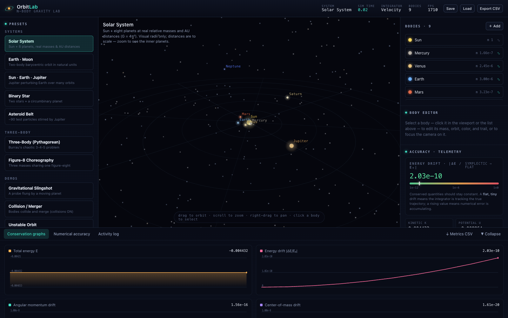
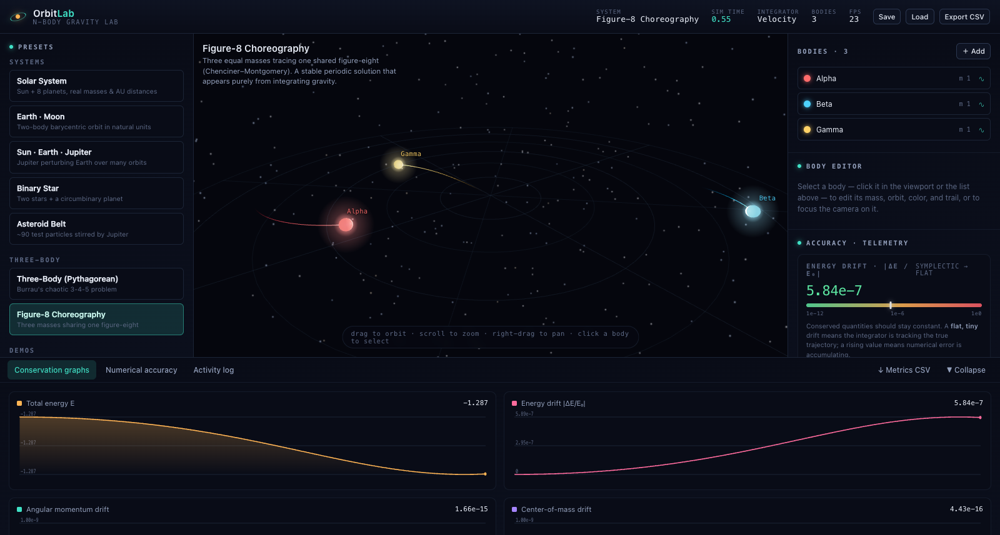

# OrbitLab

**A real-time simulator of gravity, built to be mathematically honest — and this README explains exactly how it works, starting from nothing.**

Built with React, TypeScript, Three.js, and Vite.

> **Note on the math:** the formulas below are written in LaTeX and render as
> proper equations on GitHub and in the VS Code Markdown preview. If you are
> reading this as raw text, the equations will appear as their source code
> between `$` signs — open it in a Markdown viewer to see them typeset.





---

## How to read this document

You do **not** need to know any physics or advanced math to understand OrbitLab.
This README teaches everything from the ground up: what a position is, what
gravity does, and how a computer turns those ideas into moving planets. If a
symbol looks scary, keep reading — every symbol is explained in plain words the
first time it appears.

If you already know this material, the section headers let you skip ahead.

**Contents**

1. [The one big idea](#1-the-one-big-idea)
2. [The building blocks: positions, velocity, acceleration](#2-the-building-blocks-positions-velocity-acceleration)
3. [Gravity: the only rule in the universe (here)](#3-gravity-the-only-rule-in-the-universe-here)
4. [Making things move: the problem of the future](#4-making-things-move-the-problem-of-the-future)
5. [The four integrators (and why they disagree)](#5-the-four-integrators-and-why-they-disagree)
6. [Checking our work: energy, momentum, and "drift"](#6-checking-our-work-energy-momentum-and-drift)
7. [Units: why we don't use kilometers and kilograms](#7-units-why-we-dont-use-kilometers-and-kilograms)
8. [Collisions: when two things become one](#8-collisions-when-two-things-become-one)
9. [Chaos: why the future is sometimes unknowable](#9-chaos-why-the-future-is-sometimes-unknowable)
10. [The presets](#10-the-presets)
11. [How the code is organized](#11-how-the-code-is-organized)
12. [Getting started](#12-getting-started)
13. [Testing](#13-testing)
14. [Limitations](#14-limitations)

---

## 1. The one big idea

Here is the entire concept behind OrbitLab in one sentence:

> **Every object with mass pulls on every other object, and OrbitLab figures out
> where everything moves by adding up all those pulls, over and over, thousands
> of times per second.**

That's it. The Sun pulls the Earth, the Earth pulls the Moon, the Moon pulls back
on the Earth, Jupiter tugs on everything, and so on. Each object is constantly
being pulled in many directions at once by everyone else. If you know how hard
and in which direction each thing is being pulled *right now*, you can work out
where it will be a tiny moment later. Do that repeatedly and you get motion:
orbits, flybys, collisions, chaos.

The name **"N-body"** just means "N objects" (N is math-speak for "some number").
A 2-body problem is the Earth and the Sun. A 3-body problem adds the Moon. An
N-body problem is any number of them, all pulling on each other simultaneously.

### The crucial honesty

It would be easy to *fake* an orbit. A circle is just:

```
x = cos(time)
y = sin(time)
```

Tell the computer to draw that and you get a dot going around in a circle
forever. But it's a lie — nothing is actually orbiting, it's just a spinning
animation. It can never do anything a circle can't do.

**OrbitLab never does this.** Every object stores a *position* (where it is) and
a *velocity* (how fast and which way it's moving). Nothing tells them to go in a
circle. Instead, gravity is computed, the objects are nudged, and orbits *emerge
on their own* — along with everything a real orbit can do: wobble, get pulled
off course, become egg-shaped, fling a spacecraft, or fall apart entirely. The
famous "figure-8" dance in the screenshot above is not drawn; three equal masses
were placed just so, and that pattern *fell out of the math*.

---

## 2. The building blocks: positions, velocity, acceleration

Before gravity, we need three simple ideas. If you remember only one thing:
**everything in this section is just a list of three numbers.**

### Position — *where something is*

To say where something is in 3D space, you need three numbers:

- how far **right/left** it is (call it $x$),
- how far **up/down** it is ($y$),
- how far **forward/back** it is ($z$).

So a position is written $(x, y, z)$. The Sun might sit at $(0, 0, 0)$ — the
center — and a planet at $(1, 0, 0)$, meaning "1 unit to the right of the Sun."

A trio of numbers like this is called a **vector**. You can picture a vector as
an **arrow** pointing from the origin $(0,0,0)$ to that spot. Throughout this
document, a letter with a little arrow over it — like $\vec{r}$ — means "this is
a **vector**, a bundle of three numbers," while a plain letter like $m$ (mass) or
$r$ (a distance) is a single ordinary number. We use $\vec{r}$ for position
(think "radius" or "coordinates").

### A few things you can do with vectors

You only need four operations, and they're all common sense:

- **Add** two vectors: add the $x$'s, the $y$'s, and the $z$'s separately.
  $(1, 2, 0) + (3, 0, 5) = (4, 2, 5)$. (Adding arrows = lay them tip-to-tail.)
- **Subtract** two vectors: $\vec{b} - \vec{a}$ gives the arrow *pointing from
  $a$ to $b$*. This is how we find the **direction from one object to another** —
  remember this, it's the heart of gravity.
- **Scale** a vector: multiply all three numbers by one ordinary number.
  Doubling a vector makes the arrow twice as long, same direction.
- **Length** of a vector: how long the arrow is. By the Pythagorean theorem in
  3D, the length of $\vec{r} = (x, y, z)$ is

$$
|\vec{r}| = \sqrt{x^2 + y^2 + z^2}
$$

The bars $|\;\cdot\;|$ mean "length of." So the **distance between two objects**
at positions $\vec{a}$ and $\vec{b}$ is the length of their difference,
$|\vec{b} - \vec{a}|$.

### Velocity — *how fast, and which way, something moves*

Velocity is also three numbers — it's a vector too. It says how the position is
changing: how many units per second the object moves in $x$, in $y$, and in $z$.
We write it $\vec{v}$. A velocity of $(0, 5, 0)$ means "moving 5 units per second
in the $+y$ direction." The **length** of the velocity vector, $|\vec{v}|$, is
the plain **speed** (how fast, ignoring direction).

### Acceleration — *how the velocity is changing*

Acceleration is — you guessed it — three more numbers, another vector, written
$\vec{a}$. It says how the *velocity* is changing over time. Pressing the gas
pedal in a car is acceleration; so is turning the wheel (that changes the
*direction* of your velocity, which counts too).

Here's the chain that runs the whole simulation:

$$
\text{gravity} \;\Longrightarrow\; \text{acceleration} \;\Longrightarrow\; \text{velocity} \;\Longrightarrow\; \text{position}
$$

Gravity's only job is to set the acceleration. Everything else follows.

---

## 3. Gravity: the only rule in the universe (here)

OrbitLab knows exactly one law of nature: **Newton's law of universal
gravitation**, written down in the 1680s. In words, it has just two rules:

1. **More mass = stronger pull.** A heavy object pulls harder. Double the mass,
   double the pull.
2. **More distance = weaker pull — and it drops off fast.** Specifically, the
   pull weakens with the *square* of the distance. Move twice as far away and the
   pull is 4× weaker (because $2^2 = 4$). Three times as far, 9× weaker
   ($3^2 = 9$). This is called an **inverse-square law**.

### Writing rule 1 and rule 2 as a formula

Take two objects, call them $i$ and $j$ (just labels, like "object #1" and
"object #2"). Let $m_i, m_j$ be their masses, $\vec{r}_i, \vec{r}_j$ their
positions, $r = |\vec{r}_j - \vec{r}_i|$ the distance between them, and $G$ a
fixed number called the **gravitational constant** (it just sets how strong
gravity is in our chosen units — more on that later). The **strength** of the
gravitational **force** between them is:

$$
\text{force} = G\,\frac{m_i \, m_j}{r^2}
$$

Read it out loud: the force is $G$ times the two masses multiplied together
(rule 1: more mass, more force), divided by the distance squared (rule 2:
inverse-square). That fraction bar is doing all the work.

### Force has a direction, too

A force isn't just a strength — it points somewhere. Gravity always pulls each
object **straight toward the other one**. Remember from Section 2 that
$\vec{r}_j - \vec{r}_i$ is the arrow pointing *from object $i$ to object $j$*.
That's exactly the direction object $i$ gets pulled.

To combine "strength" and "direction" into one vector, we take that direction
arrow, shrink it to length 1 (a pure direction, called a *unit vector*, made by
dividing by its length $r$), and multiply by the strength. Putting it together,
the full force vector **on object $i$, caused by object $j$**, is:

$$
\vec{F}_{ij} = G\,\frac{m_i \, m_j}{r^3}\,(\vec{r}_j - \vec{r}_i)
$$

**Why is it $r^3$ (r cubed) now, when rule 2 said $r^2$?** Look carefully: the
$(\vec{r}_j - \vec{r}_i)$ on the right is the direction arrow, but its length is
$r$, not 1. Dividing by one extra $r$ shrinks it to a pure direction. So we have
"one $r$ to fix the arrow's length" plus "two $r$'s for the inverse-square
strength" $= r^3$ on the bottom. It's still an inverse-square law; the cube is
just bookkeeping for turning the difference-of-positions into a proper direction.

This exact formula is [`pairwiseForce` in `gravity.ts`](src/physics/gravity.ts).

### From force to acceleration (and a famous cancellation)

We actually care about **acceleration**, not force, because acceleration is what
directly moves things (Section 2). They're linked by the most famous equation in
physics, Newton's second law:

$$
\text{force} = \text{mass} \times \text{acceleration}
\qquad\Longrightarrow\qquad
\text{acceleration} = \frac{\text{force}}{\text{mass}}
$$

So to get object $i$'s acceleration, divide its gravitational force by its own
mass $m_i$. Watch what happens — the $m_i$ on top cancels the $m_i$ on the
bottom:

$$
\vec{a}_i = \frac{\vec{F}_{ij}}{m_i} = G\,\frac{m_j}{r^3}\,(\vec{r}_j - \vec{r}_i)
$$

The moving object's **own mass disappears from the answer.** This is the
mathematical reason a hammer and a feather fall at the same rate (with no air) —
gravity accelerates everything equally, regardless of how heavy it is. Galileo
noticed it; the formula proves it.

### The "N" in N-body: add up every pull

So far that's the pull from *one* other object. But object $i$ is pulled by
*everyone* at once — the Sun, every planet, every moon. So we add up the
acceleration arrows from every other object $j$ (tip-to-tail, like Section 2).
The symbol $\sum$ (Greek capital sigma) just means **"add up all of these"**:

$$
\vec{a}_i = \sum_{j \ne i} G\, m_j \,
\frac{\vec{r}_j - \vec{r}_i}{\left(\,|\vec{r}_j - \vec{r}_i|^2 + \varepsilon^2\,\right)^{3/2}}
$$

Reading it: "The acceleration of object $i$ is the **sum** ($\sum$), over
**every other object** ($j \ne i$, meaning $j$ is not $i$), of $G$ times that
object's mass times the direction-toward-it, divided by distance-cubed." The
exponent $3/2$ means "raise to the power one-and-a-half," a compact way to write
"square it and take the square root" — the same $r^3$-style bottom as before.
This is the single most important line in the whole engine, and it lives in
[`computeAccelerations` in `gravity.ts`](src/physics/gravity.ts).

Every single time step, for every object, OrbitLab evaluates this sum. With $N$
objects that's roughly $N \times N$ little pulls to add up — which is why very
large $N$ gets slow, and why the asteroid-belt preset (~90 objects) is about the
comfortable limit for buttery-smooth interaction.

### One wrinkle: the $\varepsilon$ (avoiding "divide by zero")

Notice the little $+\,\varepsilon^2$ that appeared on the bottom ($\varepsilon$
is the Greek letter *epsilon*; think "a tiny bit"). Here's the problem it solves.

The distance $r$ is on the bottom of the fraction. If two objects ever get
*extremely* close, $r$ shrinks toward zero — and dividing by (nearly) zero gives
a (nearly) **infinite** answer. Computers represent infinity as a special broken
value called `NaN` ("not a number"), and once one appears it poisons everything:
the whole simulation explodes into garbage.

The fix is called **softening**. We add a small fixed number $\varepsilon^2$ to
the (squared) distance before dividing — so the denominator changes from $r^3$
to $\left(r^2 + \varepsilon^2\right)^{3/2}$:

$$
\frac{1}{r^3}
\qquad\longrightarrow\qquad
\frac{1}{\left(r^2 + \varepsilon^2\right)^{3/2}}
$$

Now even if $r$ becomes exactly zero, the bottom is
$\left(0 + \varepsilon^2\right)^{3/2} = \varepsilon^3$, a small but perfectly
finite number. The force gets very strong during a close call — but never
infinite, so the simulation survives. When objects are far apart ($r$ much bigger
than $\varepsilon$), the extra $\varepsilon^2$ is negligible and gravity behaves
exactly as normal. Think of $\varepsilon$ as a minimum effective distance. You
can change it live with the **Softening** slider.

---

## 4. Making things move: the problem of the future

We can now compute every object's acceleration at this instant. The goal is to
predict the **future**: where will everything be in one second? In one year?

### Why we can't just use a formula

For *two* bodies (say a lone planet and a star), mathematicians long ago found a
tidy formula — the orbit is a perfect ellipse, forever. But for **three or more**
bodies pulling on each other, **no such formula exists.** This isn't a gap in our
cleverness; it was proven that a general closed-form solution *cannot* be
written down. The motion can be so intricate that the only way to know the future
is to *simulate it step by step.*

### The idea of tiny time steps

Here's the trick, and it's the same trick behind every physics engine, weather
model, and animated movie. Imagine you're in a car and, at this exact instant,
you know two things: your speed and whether you're accelerating. Where are you one
second from now?

- **Rough answer:** assume your speed stays the same for the whole second and
  multiply. But your speed *is* changing (you're accelerating), so this is
  sloppy over a big second.
- **Better answer:** chop the second into a hundred slices of $1/100$ second
  each. In each tiny slice your speed barely changes, so "assume it's constant"
  is almost true. Update your speed and position each slice, then move on.

That's **numerical integration**: slice time into tiny pieces, and in each piece
nudge velocity and position forward a little. The size of one slice is written
$\Delta t$ (say "delta-tee"); the triangle $\Delta$ just means "a small amount
of," so $\Delta t$ = "a small amount of time," one slice. You control it with the
**Timestep $\Delta t$** slider.

Smaller $\Delta t$ = more accurate but more steps (slower). Bigger $\Delta t$ =
faster but sloppier. The art of a good simulation is in *how* you do each nudge —
which is the entire subject of the next section.

---

## 5. The four integrators (and why they disagree)

An **integrator** is the recipe for taking one time step: given where everything
is and how it's moving *now*, produce where everything is and how it's moving one
slice $\Delta t$ later. OrbitLab includes four, and you can switch between them
live and watch them disagree. They live in
[`src/physics/integrators/`](src/physics/integrators/).

In every recipe below, $\vec{r}$ is position, $\vec{v}$ is velocity, and
$\vec{a}$ is the gravitational acceleration from Section 3. A subscript $t$ means
"the value right now," and $t{+}\Delta t$ means "the value one slice later."

### 5.1 Explicit Euler — the naive recipe

The simplest possible idea: assume nothing changes during the slice.

$$
\begin{aligned}
\vec{v}_{t+\Delta t} &= \vec{v}_t + \vec{a}_t \, \Delta t \\[4pt]
\vec{r}_{t+\Delta t} &= \vec{r}_t + \vec{v}_t \, \Delta t
\end{aligned}
$$

Line 1: new velocity = old velocity plus "how fast it's changing" ($\vec{a}$)
times the slice length. Line 2: new position = old position plus the **old**
velocity times the slice.

It's honest and easy, but it has a fatal flaw for orbits: it only ever looks at
the acceleration at the *start* of the slice. On a curved orbit the real
acceleration swings around during the slice, so Euler consistently guesses wrong
in the same direction, and the error piles up. In practice it slowly *adds*
energy that shouldn't be there, and orbits **spiral outward** and fly away within
a few laps. We include it as a cautionary baseline — flip to it and watch a tidy
orbit unravel. ([`euler.ts`](src/physics/integrators/euler.ts))

### 5.2 Semi-implicit Euler — one tiny change, huge improvement

Change *one thing*: update the velocity **first**, then use that brand-new
velocity to move the position.

$$
\begin{aligned}
\vec{v}_{t+\Delta t} &= \vec{v}_t + \vec{a}_t \, \Delta t \\[4pt]
\vec{r}_{t+\Delta t} &= \vec{r}_t + \vec{v}_{t+\Delta t} \, \Delta t
\end{aligned}
$$

The only difference from plain Euler is that line 2 uses $\vec{v}_{t+\Delta t}$
(the just-updated velocity) instead of the old one. That's it. Astonishingly,
this small reordering makes the method **symplectic** — a special property
(explained in 5.5) that stops energy from running away. Orbits stay closed and
stable for a long time. A lovely example of how *how* you do the arithmetic
matters as much as *what* arithmetic you do.
([`semiImplicitEuler.ts`](src/physics/integrators/semiImplicitEuler.ts))

### 5.3 Velocity Verlet / Leapfrog — the default, and the best all-rounder

This one is a little more work but much smarter. It uses the acceleration at
**both ends** of the slice and averages them.

$$
\begin{aligned}
\vec{r}_{t+\Delta t} &= \vec{r}_t + \vec{v}_t \, \Delta t + \tfrac{1}{2}\,\vec{a}_t \, \Delta t^2 \\[4pt]
\vec{v}_{t+\Delta t} &= \vec{v}_t + \tfrac{1}{2}\left(\vec{a}_t + \vec{a}_{t+\Delta t}\right)\Delta t
\end{aligned}
$$

(Between the two lines, the engine computes the new acceleration
$\vec{a}_{t+\Delta t}$ at the freshly updated position.)

- The **first line** moves the position using the current velocity *plus* a curve
  correction, $\tfrac{1}{2}\,\vec{a}_t\,\Delta t^2$. (If you've ever seen
  "distance $= \tfrac{1}{2}\,a\,t^2$" for a falling object, this is the same
  term — it accounts for the path curving during the slice instead of going
  perfectly straight.)
- The **second line** updates the velocity using the **average** of the
  acceleration at the start and at the end of the slice. Averaging start-and-end
  is far fairer than Euler's start-only guess.

Because it looks at both ends, it needs to compute gravity **twice per step**
(once before moving, once after) — a little more expensive, but worth it. It is
**time-reversible**: if you ran it backwards it would retrace its exact path,
which is precisely why energy doesn't leak. This is OrbitLab's default, and it's
what serious professional N-body codes rely on.
([`leapfrog.ts`](src/physics/integrators/leapfrog.ts))

### 5.4 Runge–Kutta 4 (RK4) — most accurate per step, but with a catch

RK4 is the famous workhorse of numerical simulation. Instead of one or two peeks,
it takes **four** carefully placed peeks inside the slice and blends them.

We treat the "state" of an object as the pair (position, velocity), and note two
facts: position changes at the rate of the velocity, and velocity changes at the
rate of the acceleration —

$$
\frac{d\vec{r}}{dt} = \vec{v}, \qquad\qquad \frac{d\vec{v}}{dt} = \vec{a}(\vec{r})
$$

RK4 samples those rates four times — at the start, twice in the middle, and at
the end — each sample using the previous one to estimate where to look:

- $k_1$ = the rates at the **start** of the slice,
- $k_2$ = the rates at the **midpoint**, having stepped there using $k_1$,
- $k_3$ = the rates at the **midpoint** again, using $k_2$,
- $k_4$ = the rates at the **end**, using $k_3$.

Then it blends them, counting the two midpoint peeks twice as heavily:

$$
\text{new state} = \text{old state} + \frac{\Delta t}{6}\left(k_1 + 2k_2 + 2k_3 + k_4\right)
$$

(The divisor 6 is just $1 + 2 + 2 + 1$.) This gives the **smallest error for a
single step** of any method here — RK4 wins short-term accuracy contests.

**The catch:** RK4 is *not* symplectic. On an orbit that runs for a very long
time, its energy error slowly and steadily accumulates, so a bound orbit
gradually gains or loses energy and drifts. This surprises people: a "better,"
higher-order method can be *worse* than humble Leapfrog for long-term orbital
stability. OrbitLab's **Numerical Accuracy** panel lets you watch this happen
live. ([`rk4.ts`](src/physics/integrators/rk4.ts))

### 5.5 What "symplectic" means, in plain words

You'll see the word "symplectic" a lot. Here's the intuition without the heavy
math:

Think of a frictionless, isolated system as having a fixed **energy budget** that
should never change. A **symplectic** integrator has a special built-in respect
for that budget: its energy error stays **bounded** — it wobbles slightly up and
down around the true value but never runs away, even after millions of steps.
Non-symplectic methods (plain Euler, RK4) have no such guarantee: their energy
error can slowly **trend** in one direction forever, so orbits eventually spiral.

For orbital mechanics we almost always care more about "does the orbit stay an
orbit for a billion years?" than "how perfect is the position after one step?" —
so a symplectic method (Leapfrog) is the right default, and that's why it's ours.

### 5.6 Summary

| Method | Accuracy per step | Long-term energy behavior | Gravity evaluations per step |
|---|---|---|---|
| Explicit Euler | Worst | Runs away (orbits spiral out) | 1 |
| Semi-implicit Euler | Low | Bounded (stable) ✓ | 1 |
| **Velocity Verlet / Leapfrog** | Good | **Bounded (stable) ✓ — the default** | 2 |
| Runge–Kutta 4 | Best | Slowly drifts | 4 |

---

## 6. Checking our work: energy, momentum, and "drift"

How do we know the simulation isn't quietly lying? Because physics gives us
several quantities that, for an isolated system, are **supposed to stay exactly
constant** forever. If our numbers hold them steady, we're doing well; if they
creep, we can measure exactly how badly. These are shown live in the **Accuracy**
panel and plotted in the graphs. They're computed in
[`metrics.ts`](src/physics/metrics.ts).

### Energy

Energy comes in two forms here.

**Kinetic energy** is the energy of *motion*. A faster or heavier object has
more. For one object it's $\tfrac{1}{2}\,\text{mass}\times\text{speed}^2$; for the
whole system we add them up (the $\sum_i$ means "sum over all objects $i$"):

$$
K = \sum_i \tfrac{1}{2}\, m_i \, |\vec{v}_i|^2
$$

(Recall $|\vec{v}_i|$ is the object's speed, from Section 2.)

**Potential energy** is stored energy of *position* — like a ball held up high,
ready to fall. For gravity it's *negative* (a convention: objects that have
"fallen together" have less-than-zero energy), and it depends on how close each
pair of objects is:

$$
U = -\sum_{i<j} G\,\frac{m_i \, m_j}{\sqrt{|\vec{r}_j - \vec{r}_i|^2 + \varepsilon^2}}
$$

The $\sum_{i<j}$ means "sum over every *pair* of objects, counting each pair
once." Closer pairs contribute more (a bigger negative number). That same
softening $\varepsilon$ from Section 3 appears here so energy and force stay
consistent with each other.

**Total energy** is simply the two added together, and it's the headline number:

$$
E = K + U
$$

For an isolated gravitating system, $E$ should never change. Kinetic and
potential energy trade back and forth constantly — a comet speeds up as it falls
in (kinetic up, potential down) and slows as it climbs out — but their *sum*
stays put.

### Drift — the report card

Real integrators aren't perfect, so $E$ wanders a little. We measure that
wandering as **energy drift**: the fractional change from where it started.

$$
\text{drift} = \frac{\left|E_{\text{now}} - E_{\text{start}}\right|}{\left|E_{\text{start}}\right|}
$$

The bars $|\;\cdot\;|$ mean "absolute value" (ignore any minus sign — we only care
about the *size* of the change). A drift of $0.0001$ means the energy is off by
one-hundredth of one percent — excellent. A drift of $0.5$ means it's off by 50%
— the simulation has gone badly wrong. OrbitLab shows this on a gauge and a graph
so you can literally watch each integrator's report card in real time. A **flat,
tiny** line is what you want.

### Momentum — the system's overall "oomph"

**Momentum** is mass times velocity — a measure of how much "moving stuff" there
is and which way it's going. Total momentum is the sum over all objects:

$$
\vec{P} = \sum_i m_i \, \vec{v}_i
$$

With no outside pushes, total momentum can't change — the same principle that
makes a rocket recoil when it fires exhaust, or a gun kick back. OrbitLab tracks
how far $\vec{P}$ strays from its starting value; it should be essentially zero
(any change is pure numerical error).

### Center of mass — the balance point

The **center of mass** is the average position of all the objects, weighted by
how heavy each one is (heavier objects pull the average toward themselves):

$$
\vec{R}_{\text{cm}} = \frac{\sum_i m_i \, \vec{r}_i}{\sum_i m_i}
$$

Because every gravitational pull comes in an equal-and-opposite pair (object $i$
pulls $j$ exactly as hard as $j$ pulls $i$), all the internal pulls cancel out
and the center of mass must glide in a perfectly straight line (or sit still). If
our computed center of mass wobbles off that straight line, that wobble is,
again, pure numerical error — which we report as **center-of-mass drift**.

### Angular momentum — the "spin" that's conserved

**Angular momentum** measures how much a system is *circling* around a center —
it's the quantity that makes a spinning ice skater speed up when they pull their
arms in. For each object it combines its position and velocity through an
operation called the **cross product** (written $\times$), which specifically
measures the part of the motion that goes *around* rather than *toward or away*:

$$
\vec{L} = \sum_i m_i \, (\vec{r}_i \times \vec{v}_i)
$$

You don't need the details of the cross product; just know that $\vec{L}$ should
stay constant for an isolated system, and we track its **drift** the same way we
track energy's. Symplectic integrators tend to conserve it beautifully.

**In short:** energy, momentum, angular momentum, and the center of mass are four
independent "should-never-change" quantities. Watching their drift is how you can
*trust* — or *distrust* — a simulation, and it's the reason OrbitLab puts them
front and center instead of hiding them.

---

## 7. Units: why we don't use kilometers and kilograms

Real astronomical numbers are absurd. The Sun weighs about
$2 \times 10^{30}$ kilograms (that's a 2 followed by 30 zeros). The Earth–Sun
distance is about $1.5 \times 10^{11}$ meters. Computers store numbers with
limited precision, and multiplying gigantic numbers by tiny ones throws away
accuracy fast — like trying to add a penny to a billion dollars and keep track of
the penny.

The professional fix is to **choose friendlier units.** For solar-system-scale
presets, OrbitLab measures:

- **distance in AU** — one "astronomical unit" is the Earth–Sun distance. Earth
  orbits at distance 1.
- **mass in solar masses** — the Sun weighs exactly 1.
- **time in years** — Earth orbits once per 1.

In these units the gravitational constant $G$ (the "strength of gravity" number
from Section 3) is no longer some tiny decimal — it works out, via the geometry
of a circular orbit, to a clean value:

$$
G = 4\pi^2 \approx 39.48
$$

(Here $\pi \approx 3.14159$, so $4\pi^2 \approx 39.48$.) With this, a planet
1 AU from a 1-solar-mass star automatically orbits once per year at a speed of
$2\pi \approx 6.28$ AU/year — the real Earth, reproduced with small, well-behaved
numbers. $G$ is really just a *conversion factor* that makes the units line up;
different presets use different unit systems (some use the physicist's favorite
$G = 1$), and each preset stays internally consistent. It's all documented in
[`constants.ts`](src/physics/constants.ts).

**One more distinction: physics scale vs. drawing scale.** A real planet's radius
in AU is microscopic — you'd never see it. So OrbitLab draws objects larger than
life using separate **distance-scale** and **radius-scale** sliders. This is
purely cosmetic: it changes how big things *look*, never how the physics
computes. The simulation always runs on the true, consistent numbers.

---

## 8. Collisions: when two things become one

If you turn on **collision mode**, two objects that overlap (their centers come
closer than the sum of their radii) **merge** into a single object. The merge
obeys the same conservation laws from Section 6, so it's physically sensible.
Given two objects with masses $m_1, m_2$, positions $\vec{r}_1, \vec{r}_2$,
velocities $\vec{v}_1, \vec{v}_2$, and radii $R_1, R_2$, the merged object is:

$$
\begin{aligned}
m_{\text{new}} &= m_1 + m_2 &&\text{(masses simply add)} \\[6pt]
\vec{v}_{\text{new}} &= \frac{m_1 \vec{v}_1 + m_2 \vec{v}_2}{m_1 + m_2} &&\text{(total momentum} \div \text{total mass)} \\[6pt]
\vec{r}_{\text{new}} &= \frac{m_1 \vec{r}_1 + m_2 \vec{r}_2}{m_1 + m_2} &&\text{(the two objects' center of mass)} \\[6pt]
R_{\text{new}} &= \left(R_1^3 + R_2^3\right)^{1/3} &&\text{(their volumes add up)}
\end{aligned}
$$

- **Mass** just adds — nothing is lost.
- **Velocity** is the momentum-conserving average: total momentum
  ($m_1\vec{v}_1 + m_2\vec{v}_2$, from Section 6) divided by the new total mass.
  This is exactly what keeps the system's momentum unchanged through the
  collision.
- **Position** is placed at the pair's center of mass, so nothing jumps.
- **Radius** comes from adding **volumes**, not radii. A ball's volume grows with
  the *cube* of its radius, so to combine two balls we add their $R^3$ values and
  take the cube root. (Adding the radii directly would wrongly inflate the
  result.)

Notice that **energy is deliberately not conserved** here — a real inelastic
collision (two lumps of clay sticking) turns the energy of their relative motion
into heat, which our simulation doesn't track. So when a merge happens you'll see
the energy-drift number jump: that's correct physics, not a bug. The code is in
[`collisions.ts`](src/physics/collisions.ts).

---

## 9. Chaos: why the future is sometimes unknowable

Here is one of the most beautiful and unsettling facts in all of science, and you
can see it yourself in OrbitLab.

Load the **Three-Body (Pythagorean)** preset: three objects released from rest.
For a two-body system, the motion is a clean, predictable ellipse forever. But
add a third object and the system becomes **chaotic**: the three objects swing
around each other in a wild, intricate dance, have near-collisions, fling each
other about, and eventually kick one object out entirely.

"Chaotic" has a precise meaning: **the tiniest change in the starting conditions
leads to a completely different future.** If you nudge one object by a millionth
of a unit — or even just change the timestep $\Delta t$ — the dance unfolds the
same way for a while, then diverges into something totally different. This isn't a
flaw in the simulation; it's a real property of gravity with three or more
bodies. It's the same reason weather can't be forecast far ahead, and why the
exact positions of the planets billions of years from now are genuinely
unknowable, even in principle.

OrbitLab lets you *feel* this: run the three-body or figure-8 preset, hit reset,
change $\Delta t$ a hair, and watch the outcome change. That sensitivity is the
signature of chaos — and a reminder that "computed, not scripted" isn't just a
design choice, it's the only honest way to show behavior this rich.

---

## 10. The presets

Each preset is a small, documented file in [`src/presets/`](src/presets/) that
lays out starting positions, velocities, masses, and the unit convention — then
hands them to the engine and lets gravity take over.

| Preset | What it shows you |
|---|---|
| **Solar System** | The Sun and 8 planets at real relative masses and true AU distances |
| **Earth · Moon** | Two objects orbiting their shared balance point (both move — Earth wobbles) |
| **Sun · Earth · Jupiter** | Jupiter's gravity slowly perturbing Earth's orbit over many laps |
| **Binary Star** | Two stars circling each other, plus a distant planet orbiting both |
| **Asteroid Belt** | ~90 tiny test objects between Mars and Jupiter, stirred by Jupiter's pull |
| **Three-Body (Pythagorean)** | The classic chaotic dance that ejects one object |
| **Figure-8 Choreography** | Three equal masses chasing each other around one shared figure-eight |
| **Gravitational Slingshot** | A light probe stealing speed from a moving planet during a flyby |
| **Collision / Merger** | Objects falling together and merging (collisions ON) |
| **Unstable Orbit** | Over-packed heavy planets whose orbits cross and fling one away |

---

## 11. How the code is organized

The single most important design rule: **the physics engine knows nothing about
the screen.** It's plain TypeScript with no React and no Three.js, so it can be
tested on its own and reasoned about in isolation. The 3D view reads from it; the
buttons and sliders drive it.

```
src/
  physics/                 ← the pure engine (no React, no Three.js, fully tested)
    Vector3.ts             the three-numbers "vector" from Section 2
    Body.ts                one object: mass, radius, position, velocity, color…
    constants.ts           unit conventions, G, softening (Section 7)
    gravity.ts             the force + acceleration law (Section 3) — the only place gravity lives
    integrators/           the four stepping recipes (Section 5)
    collisions.ts          the merge rules (Section 8)
    metrics.ts             energy, momentum, angular momentum, drift (Section 6)
    simulation.ts          ties it together: holds state, takes steps, records history, saves/loads
  presets/                 ← the 10 starting scenarios (Section 10)
  rendering/               ← the 3D view: stars, glowing bodies, trails, camera (Three.js)
  state/                   ← connects engine ↔ interface; runs the animation loop
  ui/                      ← sidebars, the accuracy panel, graphs, body editor, comparison
  tests/                   ← automated checks that the math is correct (Section 13)
```

**How a frame works:** a render loop runs ~60 times a second. Each frame, the app
asks the engine to take one or more time steps (Section 4), then copies the new
positions onto the 3D spheres. About ten times a second it also samples the
metrics (Section 6) and updates the panels and graphs. The heavy per-frame motion
never goes through the interface framework, which keeps everything smooth.

---

## 12. Getting started

You need [Node.js](https://nodejs.org/) version 18 or newer (developed on Node 22)
and npm, which comes with it.

```bash
npm install     # download the dependencies (one time)
npm run dev     # start the app in development mode
```

Then open the address it prints (by default **http://localhost:5173**) in a
modern browser. That's it.

Other commands:

```bash
npm run build      # check the types and build an optimized version into dist/
npm run preview    # serve that built version locally
npm run test       # run the automated physics tests
npm run typecheck  # check the TypeScript types without building
```

**Using it:** pick a preset on the left, press play, and drag in the 3D view to
orbit the camera (scroll to zoom, right-drag to pan). Switch integrators and
watch the **Energy drift** gauge on the right. Open the **Numerical Accuracy**
tab at the bottom to race all four integrators on the same scenario. Click any
object to select and edit it, or add your own.

---

## 13. Testing

Because the physics engine is separate from the screen, its math can be checked
automatically — no browser needed. The suite in [`src/tests/`](src/tests/) has 31
tests (run with `npm run test`) that verify the science, including:

1. **Newton's third law** — object $i$ pulls object $j$ exactly as hard as $j$
   pulls $i$.
2. **Momentum is conserved** — total momentum stays put for every integrator.
3. **Merges conserve momentum** — including three-way pile-ups.
4. **A circular orbit stays circular** under Leapfrog over many laps.
5. **Leapfrog beats Euler** — far less energy drift over a long run.
6. **The center of mass stays put** for a balanced system.
7. **RK4 is accurate short-term** — returns to its start after one orbit.
8. **Softening works** — no `NaN`/infinity even through a head-on close approach.

These are the mathematical claims this README makes, turned into checks a
computer can confirm.

---

## 14. Limitations

OrbitLab is an honest Newtonian sandbox, not a professional astronomy tool. On
purpose, it does **not** model:

- **Einstein's relativity** — no subtle orbit precession from general relativity,
  no bending of light, no gravitational waves. It's pure Newton.
- **Real ephemeris precision** — masses and distances are realistic but rounded.
  Don't plan a space mission with it.
- **Air drag, radiation pressure, tides, or planet shape** — objects are ideal
  points; their radius only matters for drawing and collisions.
- **Fancy collision physics** — merges are perfectly sticky; there's no bouncing,
  shattering, or gradual accretion.
- **Huge numbers of bodies** — gravity is computed the exact, direct way (every
  pair), which is simple and correct but limits how many objects stay smooth
  (~90 is comfortable).

These are the honest trade-offs of a real-time, in-the-browser, learn-by-watching
simulator — and the whole thing runs from a single `npm install && npm run dev`.
